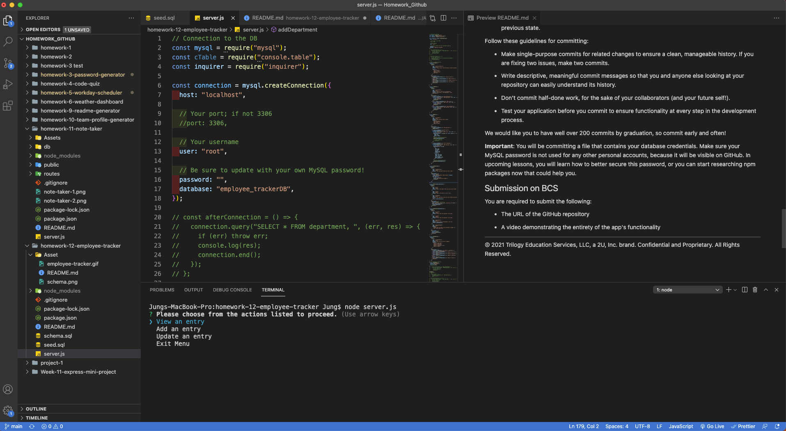
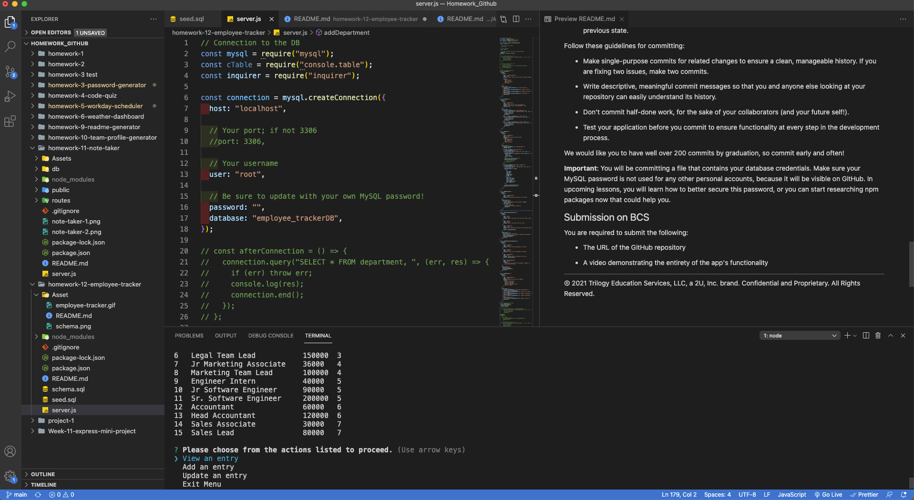

# Homework-11: Note Taker.

# Description

This was my homework #12 Employee Tracker. In this homework, the objective was architect and build a solution for managing a company's employees using node, inquirer, and MYSQL.

I first started this homework by installing following dependencies: chalk, clear, console.table, figlet, inquirer, mysql, and util.

After installing dependencies, I created a file called schema.sql a database called employee_trackerDB, and created 3 tables within the database called department, roles, and employee. Afterwrads, I created a seed.sql which contains information about different departments, roles, and information about fake employees.

From there, I moved onto the majority of my work in server.js file. First i started the code by requiring MYSQL and inquirer package. Then I wrote .prompt to ask user what actions they would like to take. They can start the code by typing "node server.js" which will begin to ask the user series of questions. There are total of 4 choices that user can respond to.

1. View an entry
2. Add an entry
3. Update an entry
4. Exit Menu

The way I built out these code was... I create separte function for each user input, and within that function the code will interact with the database to either add an entry or update an entry, and that will be processed and saved in the DB.

# Installation

1. Please type in "npm i"  
2. Run the code by typing "node server.js"
3. Follow the promopt

# Usage

Please follow the directions from README file.

# Contributing

Please follow the directions from README file.

# Tests

Please follow the directions from README file.

# Questions

Need to contact [jung0808?](https://github.com/jung0808)  
[You can contact me here - Email](mailto:j.nam0808@gmail.com)

# Screenshot of Project

##   Attached is also a personal link to my homework assignment #12

## https://github.com/jung0808/homework-12-employee-tracker
